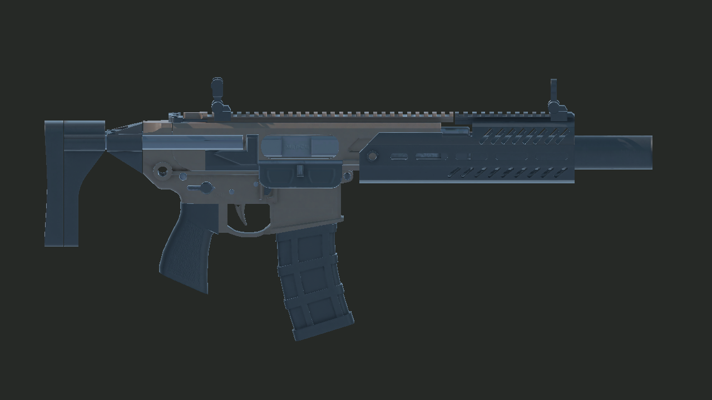

# 任务 002 - MCX 步枪 + 双手持枪抓取交付记录

## 任务信息
- 编号: 002
- 标题: MCX 步枪 + 双手持枪抓取
- 规格书: `docs/tasks/002-rifle-grab.md`
- Unity: 6000.4.1f1
- XRI: 3.4.1

## 本次完成内容
- 复制 MCX game-ready 资产到 `Assets/Art/...`，未修改 `Assets/DelthorGames/MCX/` 原始包。
- 新建 `Assets/Art/Materials/MCX_Canebrake_URP.mat`，使用 `Universal Render Pipeline/Lit`。
- Base Map 使用 `MCX_MatCanebrake_AlbedoTransparency`，Metallic/Smoothness 使用 `MCX_Mat_MetallicSmoothness`，Normal 使用 DirectX 版 `MCX_Mat_NormalDirectX`，并接入 AO/Height。
- 复制后的 `Assets/Art/Models/MCX.fbx` 设置 `useFileScale=false`，`globalScale=0.0006210711`，实测长轴 Z = `0.8500m`。
- 新建 `Assets/Art/Prefabs/Rifle_MCX.prefab`，包含 5 个命名挂点、`XRGrabInteractable`、`XRGeneralGrabTransformer`、`Rigidbody`、2 个简化 `BoxCollider`、`RifleController`。
- 在 `Assets/Scenes/Range.unity` 的 `FiringPoint` 前方放置 `RifleTable_002` 和 `Rifle_MCX_002`。

## 材质转换截图

确认项:
- Prefab 45 个 Renderer 全部使用同一个 `MCX_Canebrake_URP` 材质。
- 材质 Shader 为 `Universal Render Pipeline/Lit`。
- 截图中无 URP 洋红材质。

## 尺寸校正
- 原始 Prefab 实测包围盒长轴: Z = `13.68603`。
- Game-ready FBX 实测包围盒: X/Y/Z = `0.0816 / 0.3694 / 0.8500`。
- 由于关闭 `useFileScale` 后使用 FBX 原始单位，最终 `globalScale` 为 `0.0006210711`；结果以 Unity 实测长轴 `0.8500m` 为准。

## 挂点摆放
- `Grip_Primary`: `(0.0000, -0.0750, -0.1250)`
- `Grip_Secondary`: `(0.0000, 0.0150, 0.1550)`
- `MuzzlePoint`: `(0.0000, 0.0550, 0.4347)`
- `Sight_Rear`: `(0.0000, 0.1450, -0.0950)`
- `Sight_Front`: `(0.0000, 0.1450, 0.2850)`
- `MuzzlePoint.forward` 验证为 `(0, 0, 1)`，即本地 +Z 指向枪口方向。

## 抓取手感选择
- `XRGrabInteractable.selectMode = Multiple`
- `Movement Type = Instantaneous`，优先降低 VR Device Simulator 下的持枪延迟。
- `attachTransform = Grip_Primary`
- `secondaryAttachTransform = Grip_Secondary`
- `XRGeneralGrabTransformer.allowTwoHandedRotation = FirstHandDirectedTowardsSecondHand`
- 禁用 one-hand/two-hand scaling，避免双手据枪时改变枪体比例。
- `Rigidbody.useGravity = true`，放手后可落到枪桌/地面。
- 碰撞体为 2 个根级 `BoxCollider`，无 `MeshCollider`。

## RifleController
- 文件: `Assets/Scripts/Weapon/RifleController.cs`
- 命名空间: `VRGunShoot.Weapon`
- 订阅方式: 脚本在 `OnEnable` 内订阅 `XRGrabInteractable.selectEntered/selectExited`，不依赖 Inspector UnityEvent 手工连线。
- `IsHeld = interactorsSelecting.Count > 0`
- `IsTwoHanded = interactorsSelecting.Count == 2`
- 不包含开火、瞄准、弹道、后座逻辑。

## 变更文件
- `Assets/Art/Models/MCX.fbx`
- `Assets/Art/Textures/MCX/*`
- `Assets/Art/Materials/MCX_Canebrake_URP.mat`
- `Assets/Art/Materials/Range_Table_URP.mat`
- `Assets/Art/Prefabs/Rifle_MCX.prefab`
- `Assets/Scripts/Weapon/RifleController.cs`
- `Assets/Scenes/Range.unity`
- `docs/codex-reports/002-rifle-grab.md`
- `docs/codex-reports/002-rifle-grab-material.png`

## 验证结果
- Unity MCP 编译/执行命令成功，`RifleController` 导入类为 `VRGunShoot.Weapon.RifleController`。
- Prefab 结构验证:
  - Renderer count = `45`
  - Material count = `1`
  - Shader = `Universal Render Pipeline/Lit`
  - Length Z = `0.8500m`
  - 5 个挂点齐备
  - `XRGrabInteractable.selectMode = Multiple`
  - `XRGeneralGrabTransformer` 存在
  - `BoxCollider = 2`
  - `MeshCollider = 0`
- 状态验证:
  - 0 interactor: `IsHeld=False`, `IsTwoHanded=False`
  - 1 interactor: `IsHeld=True`, `IsTwoHanded=False`
  - 2 interactor: `IsHeld=True`, `IsTwoHanded=True`
  - release all: `IsHeld=False`, `IsTwoHanded=False`
- Play Mode 冒烟:
  - 单场景运行: `Assets/Scenes/Range.unity`
  - `XR Origin` count = `1`
  - `XRDeviceSimulator` component count = `1`
  - `Rifle_MCX_002` 和 `RifleTable_002` 存在
  - Runtime `RifleController` 初始状态为未持枪
- Console:
  - Error count = `0`
  - 仍有 Unity/XR 环境 Warning，包括 `OpenXRPackageSettings.asset` inconsistent import、XR simulated controller haptics warning、Unity AI Assistant account warning。

## Claude Code 重点检查项
- 用真实 XR Device Simulator 操作确认主手/副手抓握点手感，必要时微调 `Grip_Primary` / `Grip_Secondary`。
- 确认 Canebrake 材质在目标光照下的观感，特别是复制 FBX 中 `Cube.003_low` 源网格缺 normals/tangents 时的法线表现。
- 确认 `Instantaneous` 是否满足手感；若需要更物理的碰撞跟随，可改成 `Velocity Tracking` 再调阻尼。
- 确认枪桌高度和初始摆位是否符合玩家伸手可抓范围。

## 已知说明
- `Assets/DelthorGames/MCX/` 原始资源未编辑。
- 由于 `useFileScale=false` 后 FBX 原始单位不同，导入 `globalScale` 数值不是 `0.062`，但最终 Unity 实测枪长为 `0.8500m`。
- 本任务未实现开火、瞄具对齐、弹道、后座。
